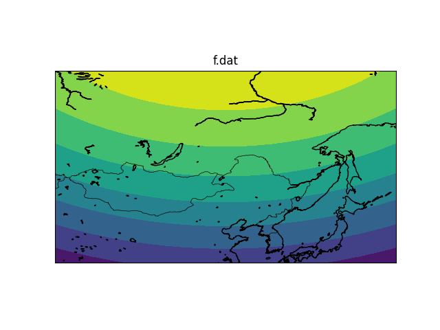

# 正压原始方程模式实习报告
可在https://github.com/leosssssss/NumericalModelingFinalExp查看完整内容
## 内容目录
1. 实习目的与要求
2. 模式的主要计算框图
3. 实习任务
4. 实习程序（自己编制的子程序）
5. 结果（图形）及其分析                       
6. 小结与讨论
## 实习目的与要求
### 实习目的
通过正压原始方程模式的实习，加深理解该章所学的基本内容；掌握当今制作数值天气预报的一般方法和主要步骤；并在数值计算、编制程序和上机操作等方面得到进一步训练。
### 实习要求
以1973年4月29日08时(北京时)我国东北、华北地区500百帕等压面位势高度场及地转风场作为初值，采用固定的水平侧边界条件，应用正压原始方程二次守恒平流格式的模式，制作未来24小时有限区域500百帕位势高度场和风场的预报，并写一份实习报告。
## 模式的主要计算框图

## 实习任务
### 编写2个子程序：五点平滑子程序、地转风初值子程序
1. 五点平滑公式
\[
\tilde{F}^{x,y}_{i,j} = F_{i,j} + \frac{S}{4} \left( F_{i+1,j} + F_{i,j+1} + F_{i-1,j} + F_{i,j-1} - 4F_{i,j} \right)
\]
2. 地转风公式
\[
u_{i,j} = u^0_{i,j} = - \frac{m_{i,j} g \frac{\partial z^0_{i,j}}{\partial y}}{f_{i,j}}
\]
\[
v_{i,j} = v^0_{i,j} = \frac{m_{i,j} g \frac{\partial z^0_{i,j}}{\partial x}}{f_{i,j}}
\]
### 完成四个讨论
1. 只做正平滑和做正逆平滑的对比试验；
2. 地转风子程序中不同差分格式的数值试验；
3. 是否做边界平滑和内点平滑的数值试验；
4. 是否做时间平滑的数值试验。
## 实习程序（自己编制的子程序）
1. 地转风（使用中央差）
```fortran
    subroutine cgw(ua,va,za,rm,f,d,m,n)
      ! using: zyc
      dimension ua(m,n),va(m,n),za(m,n),f(m,n),rm(m,n)
      g = 9.8
      ! not at the boundary, using zyc
      do i=2, m-1
            do j=2, n-1
                  ua(i, j) = -(rm(i, j) * g / f(i, j)) * (za(i, j+1) - za(i, j-1)) / (2 * d)
                  va(i, j) = (rm(i, j) * g / f(i, j)) * (za(i+1, j) - za(i-1, j)) / (2 * d)
            end do
      end do
      ! at boundary
      ! the upper and lower part using qc and hc seprately
      do i=1, m
            ua(i, 1) = -(rm(i, 1) * g / f(i, 1)) * (za(i, 2) - za(i, 1)) / d
            ua(i, n) = -(rm(i, n) * g / f(i, n)) * (za(i, n) - za(i, n-1)) / d
      end do 
      ! the left and right part using qc and hc seprately
      do j=1, n
            va(1, j) = (rm(1, j) * g / f(1, j)) * (za(2, j) - za(1, j)) / d
            va(m, j) = (rm(m, j) * g / f(m, j)) * (za(m, j) - za(m-1, j)) / d
      end do
      end
```
2. 地转风（使用前差）
```fortran
      subroutine cgw(ua,va,za,rm,f,d,m,n)
      ! using: qc
      dimension ua(m,n),va(m,n),za(m,n),f(m,n),rm(m,n)
      g = 9.8
      ! not at the boundary, using: qc
      do i=2, m-1
            do j=2, n-1
                  ua(i, j) = -(rm(i, j) * g / f(i, j)) * (za(i, j+1) - za(i, j)) / d
                  va(i, j) = (rm(i, j) * g / f(i, j)) * (za(i+1, j) - za(i, j)) / d
            end do
      end do
      ! at boundary
      ! the upper and lower part using qc and hc seprately
      do i=1, m
            ua(i, 1) = -(rm(i, 1) * g / f(i, 1)) * (za(i, 2) - za(i, 1)) / d
            ua(i, n) = -(rm(i, n) * g / f(i, n)) * (za(i, n) - za(i, n-1)) / d
      end do 
      ! the left and right part using qc and hc seprately
      do j=1, n
            va(1, j) = (rm(1, j) * g / f(1, j)) * (za(2, j) - za(1, j)) / d
            va(m, j) = (rm(m, j) * g / f(m, j)) * (za(m, j) - za(m-1, j)) / d
      end do
      end
```
3. 地转风（使用后差）
```fortran
      subroutine cgw(ua,va,za,rm,f,d,m,n)
      ! using: hc
      dimension ua(m,n),va(m,n),za(m,n),f(m,n),rm(m,n)
      g = 9.8
      ! not at the boundary, using: hc
      do i=2, m-1
            do j=2, n-1
                  ua(i, j) = -(rm(i, j) * g / f(i, j)) * (za(i, j) - za(i, j-1)) / d
                  va(i, j) = (rm(i, j) * g / f(i, j)) * (za(i, j) - za(i-1, j)) / d
            end do
      end do
      ! at boundary
      ! the upper and lower part using qc and hc seprately      
      do i=1, m
            ua(i, 1) = -(rm(i, 1) * g / f(i, 1)) * (za(i, 2) - za(i, 1)) / d
            ua(i, n) = -(rm(i, n) * g / f(i, n)) * (za(i, n) - za(i, n-1)) / d
      end do
      ! the left and right part using qc and hc seprately 
      do j=1, n
            va(1, j) = (rm(1, j) * g / f(1, j)) * (za(2, j) - za(1, j)) / d
            va(m, j) = (rm(m, j) * g / f(m, j)) * (za(m, j) - za(m-1, j)) / d
      end do
      end
```
4. 五点平滑
```fortran
      subroutine ssip(a,w,s,m,n,k,l)
            ! a: argument; w: wa; s: ; m: grids in x axis; n: grids in y axis;
            ! raise error when input the invalid argument
            integer :: m, n
            dimension a(m, n), w(m, n)
            real :: s
            integer :: l
            if (l == 0) then
                  return
            elseif (l /= 1 .and. l /= 2) then 
                  stop "INvalid value: `l`"
            end if
            ! do the first smoothing
            do i=2, m-1
                  do j=2, n-1
                        w(i, j) = a(i, j)+s/4*(a(i+1, j)+a(i, j+1)+a(i, j-1)-4*a(i, j))
                  end do
            end do
            ! if have to smoothing again, do it on the original array
            if (l==2) then
                  s = -s
                  do i=2, m-1
                        do j=2, n-1
                              w(i, j) = w(i, j)+s/4*(w(i+1, j)+w(i, j+1)+w(i, j-1)-4*w(i, j))  
                        end do
                  end do
            else
            ! else, return the array after transform into the right format
                  do i=2, m-1
                        do j=2, n-1
                              a(i, j) = w(i, j)
                        end do
                  end do
            endif
      end
```
3. 绘图程序
```python
import pandas as pd
import numpy as np
import os
import matplotlib.pyplot as plt
from mpl_toolkits.basemap import Basemap

# x axis
x_start = 85
x_interval = 3.5
x_count = 20
x_axis = [x_start + x_interval * i for i in range(x_count)]

# y axis
y_start = 32.5
y_interval = 2.5
y_count = 16
y_axis = [y_start + y_interval * i for i in range(y_count)]


dirs = r'F:\202183300574' # the direction of work space
for file in os.listdir(dirs):
    # read files one by one and draw
    f = np.genfromtxt(os.path.join(dirs, file))
    # skip the 0 size file 
    if f.size == 0:
        continue
   # initalize the map
    m = Basemap(projection='cyl', llcrnrlat=32.5, urcrnrlat=70, llcrnrlon=85, urcrnrlon=151.5, resolution='i')

    # draw boundaries
    m.drawcoastlines()
    m.drawcountries()
    # m.drawparallels(np.arange(32.5, 70, 2.5), labels=[1, 0, 0, 0])
    # m.drawmeridians(np.arange(85, 152, 3.5), labels=[0, 0, 0, 1])
    # draw figures
    plt.contourf(x_axis, y_axis, f)
    plt.title(file)
    plt.colorbar(label='m/s or m')
    plt.show()


```
## 结果（图形）及其分析
### 恒量argument


### 原始数据
1. u风场

1. v风场

1. 高度场

**分析**：根据三张图的信息，可以看出在外东北的上空存在明显的东北气旋，在中西伯利亚有明显的极涡存在。
### 正平滑且不静力初始化的情况
1. u风场

1. v风场

1. 高度场

**分析**：与原始数据对比发现，在不进行静力初始化+只采取一次正平滑的情况下，预报的效果很差，产生了很多有棱有角的气团，也没有正确反映两个气旋的变化。而且在高度场上可以看出边界有明显的预测错误。
### 正逆平滑且不静力初始化的情况
1. u风场

1. v风场

1. 高度场

**分析**：在平滑过程中添加了一次逆平滑后，显著的提升了预测中气旋的平滑程度，消除了大部分等值线的棱角，同时反映出了两个气旋的特征。说明正逆平滑比单正平滑有更好的预报效果。
### 静力初始化的情况
#### 中央差
1. u风场
   
1. v风场

#### 前插
1. u风场
 
1. v风场

#### 后插
1. u风场

2. v风场

#### 分析
三种差分格式在静力初始化时并没有产生明显的性能差异，均能基本正确地反映原始数据。
为了方便，后续皆使用<span style="color:red">中央差分</span>的静力初始化方案。
### 正平滑且静力初始化的情况
1. u风场

2. v风场

3. 高度场

**分析**：预测效果进一步提升，能够好的反映两个气旋的存在与强度，但还是存在一些棱角。说明单纯的正平滑还是不能完全滤去短波的同时减小对长波的影响，不过，静力初始化带来的预测效果提升仍然是相当的明显的
### 正逆平滑且静力初始化的情况
1. u风场

2. v风场

3. 高度场

**分析**：预测效果是最好的。能够基本准确的反映各个系统的特征，也不会出现明显的棱角，说明正逆平滑在保留了长波的信息同时也很好的滤去了短波的影响。因此在预报的时候要结合正逆平滑以及静力初始化使用以达到最好的预测效果。
### 在做正逆平滑且静力初始化后其他情况的讨论
#### 一、不做边界平滑的情况
1. u风场

2. v风场

3. 高度场

#### 二、不做内点平滑的情况
1. u风场

2. v风场

3. 高度场

#### 三、不做时间平滑的情况
1. u风场

2. v风场

3. 高度场

#### 讨论
似乎不做这些平滑只会对预测结果产生轻微的影响。
## 小结与讨论
经过上述实验过程，可以发现：
1. 影响预测准确程度最大的是静力初始化和平滑的方式，其中静力初始化的影响最为显著。
2. 对于本次实验来说，似乎不做时间、边界、内点这些平滑不会对实验结果产生太大的影响。
3. 不同的静力初始化的差分格式不会对结果产生太大的影响。
4. 建议：优先选做静力初始化和正逆平滑，其他的部分不会对准确程度产生太大的影响。
   
